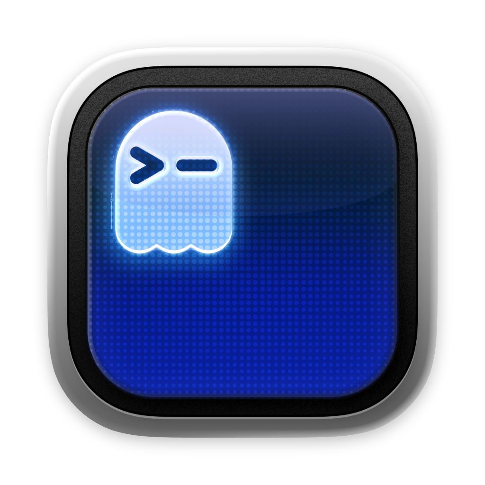
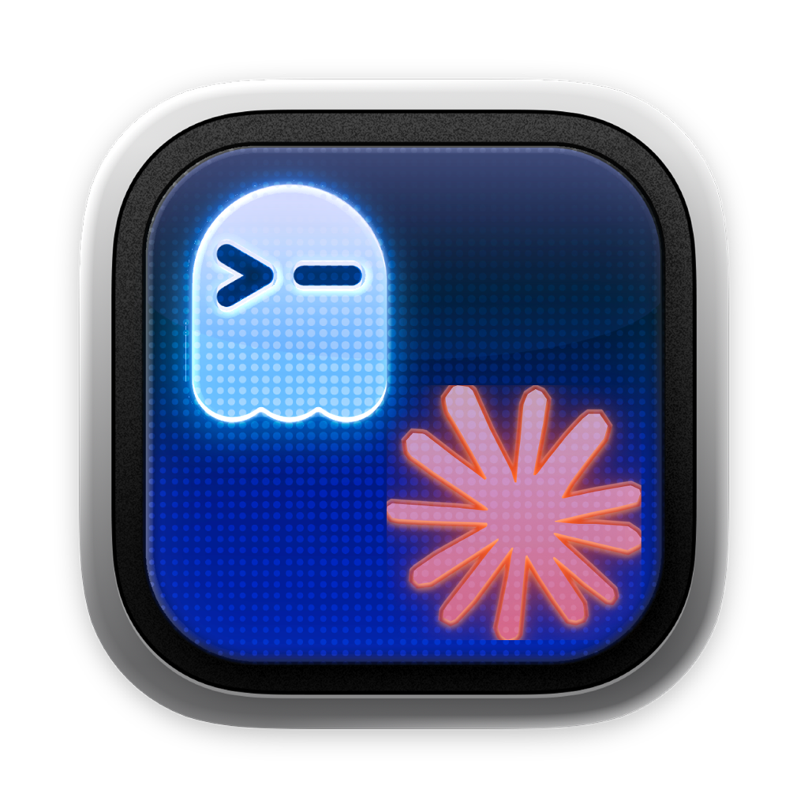

# Ghostty's Friends

Finder toolbar apps that open [Ghostty](https://ghostty.org) in the current folder.

| cd2-ghostty | ccOpener-ghostty |
|:-----------:|:----------------:|
|  |  |
| Open Ghostty here | Open Ghostty + [Claude Code](https://docs.anthropic.com/en/docs/claude-code) |

## Install

1. Download **ghosttys-friends.dmg** from [Releases](../../releases/latest)
2. Open the DMG and drag both apps somewhere (e.g. `~/Documents/`)
3. **Cmd-drag** each app into the Finder toolbar

> On first launch, macOS may block the app. Right-click → **Open** to bypass Gatekeeper.

## Usage

Click the icon in any Finder window:

- **cd2-ghostty** — Opens a new Ghostty terminal in that folder
- **ccOpener-ghostty** — Opens Ghostty and runs `claude --dangerously-skip-permissions` in that folder

## Build Your Own

The source AppleScripts are in [`src/`](src/). Compile to `.app` with:

```bash
osacompile -o cd2-ghostty.app src/cd2-ghostty.applescript
```

Edit the scripts to customize — e.g. change the command, use a different terminal, etc.

## License

[MIT](LICENSE)
